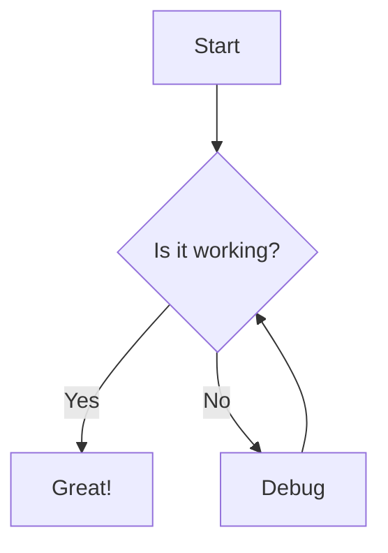
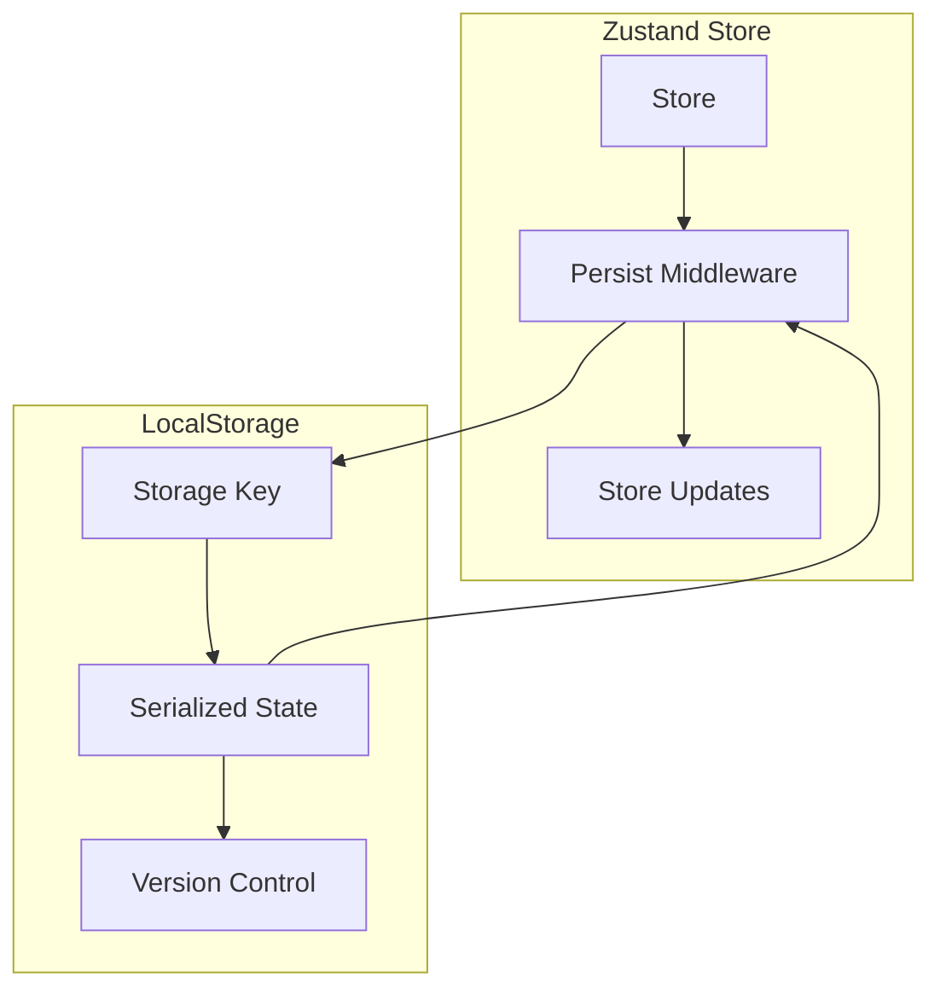

# Mermaid test

```mermaid
graph TD
    A[Start] --> B{Is it working?}
    B -->|Yes| C[Great!]
    B -->|No| D[Debug]
    D --> B
```

## Arquitectura de Persistencia

```mermaid
graph TD
    subgraph "Zustand Store"
        A[Store] --> B[Persist Middleware]
        B --> C[Store Updates]
    end
    
    subgraph "LocalStorage"
        D[Storage Key] --> E[Serialized State]
        E --> F[Version Control]
    end
    
    B --> D
    E --> B
```
