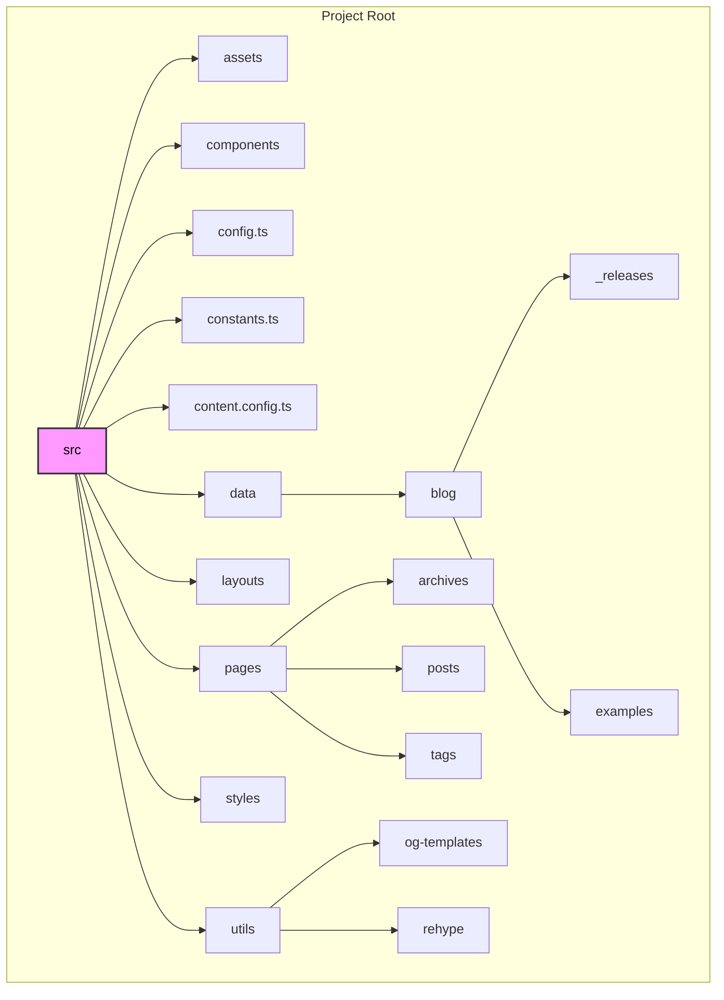
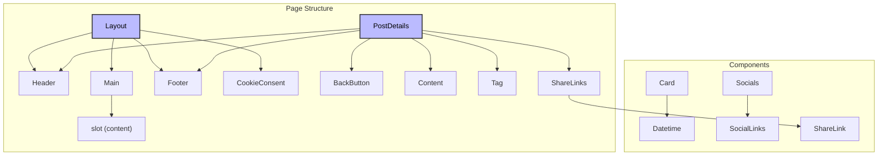
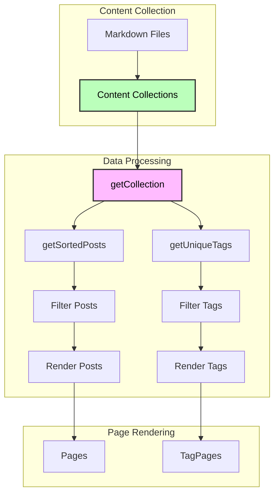
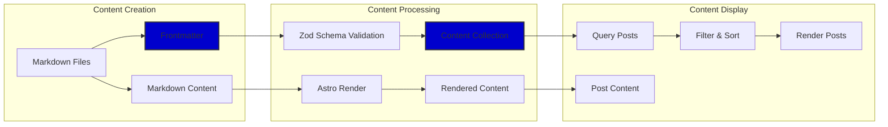
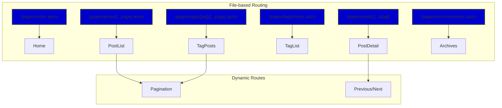
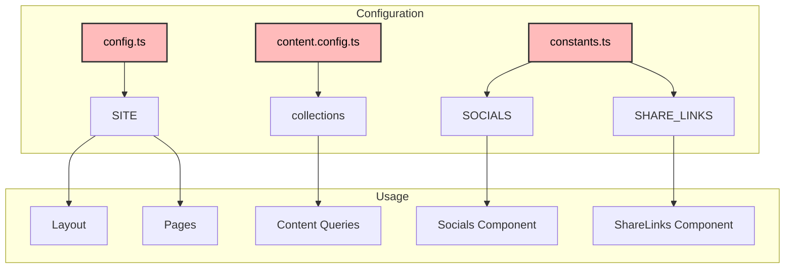
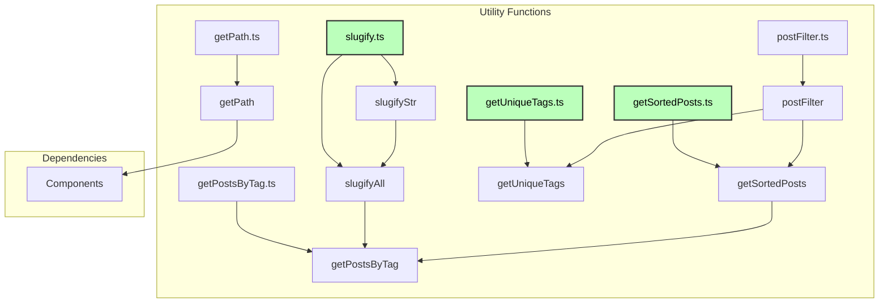

| **DISCLAIMER**: Analysis made with Claude 3.7 Sonnet - for testing and learning purposes.

## Table of contents

# Project Architecture Analysis

Based on my examination of the codebase, I can provide a comprehensive analysis of the architecture of this Astro-based blog project. I'll create several Mermaid diagrams to visualize different aspects of the architecture.

## Project Overview

This is a well-structured Astro blog project with clear separation of concerns, content collections for blog posts, component-based architecture, and utility functions for data processing. The project follows modern web development practices and is organized in a modular way.

## 1. Project Structure Diagram

## 2. Component Hierarchy Diagram

## 3. Data Flow Diagram

## 4. Content Processing Pipeline

## 5. Routing Architecture

## 6. Configuration and Constants Architecture

## 7. Utility Functions Architecture

## Key Architectural Patterns

1. **Content Collection Pattern**: The project uses Astro's content collections to manage blog posts with schema validation.

2. **Component Composition Pattern**: UI is built by composing smaller components into larger ones, with clear separation of concerns.

3. **Layout Pattern**: Different layouts are used for different page types, with shared components.

4. **File-based Routing**: Astro's file-based routing system is used for creating static and dynamic routes.

5. **Utility Function Pattern**: Small, focused utility functions handle specific data processing tasks.

6. **Configuration Centralization**: Site-wide settings are centralized in config files.

7. **Frontmatter Metadata**: Blog posts use frontmatter for metadata, which is validated against a schema.

8. **Dynamic OG Image Generation**: The project supports dynamic Open Graph image generation.

## Modularization Strategy

The project is well-modularized with:

1. **Component Reusability**: Components like Card, Tag, and Datetime are reused across different pages.

2. **Utility Function Composition**: Utility functions are composed together to create more complex functionality.

3. **Layout Inheritance**: Pages inherit from layouts, which provide consistent structure.

4. **Configuration Separation**: Different aspects of configuration are separated into different files.